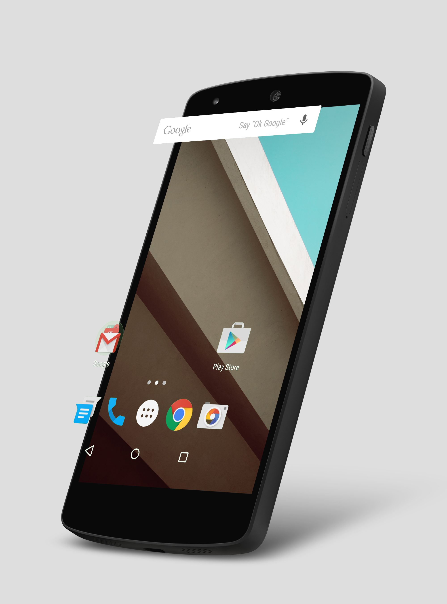

Motion
======

An Android library allowing images to exhibit a parallax effect. By replacing static pictures
and backgrounds with a fluid images that reacts to screen tilt and orientation, Android
applications can add a perceived depth, layering, and context to their content. Motion works
great for both full screen background images and smaller sized pictures to give users a whole new
perspective on how they interact with their phone. This project was inspired in part by
iOS 7's new parallax effect.



Demo
----

Feel free to download the [demo][1] to try out motion.

Setup
-----
* In Eclipse, just import the library as an Android library project.
* Project > Clean to generate the binaries you need, like R.java, etc.
* Then, just add Motion as a dependency to your existing project and you're good to go!

**Or**:

* [Download the .jar file][2]
* Add the .jar files to your project's `libs` folder, or add them as external jars to your project's
build path.

**Or**:

Add the following to your `build.gradle`:

	repositories {
		mavenCentral()
	}

	dependencies{
		compile 'com.nvanbenschoten.motion:library:1.0.1'
	}

**Or**:

Add the following to your `pom.xml`:

	<dependency>
		<groupId>com.nvanbenschoten.motion</groupId>
		<artifactId>library</artifactId>
		<version>1.0.1</version>
		<type>aar</type>
	</dependency>

Usage
-----

To use Motion, simply replace any existing ImageView's with a ParallaxImageView.

Once a reference to this view is acquired, register a SensorManager with the
ParallaxImageView using the `registerSensorManager()` call. This registration
is most commonly done in the `onResume` method of an `Activity/Fragment`, but can be
completed whenever the parallax effect is desired to begin.

When the parallax effect is not longer needed, it is essential to unregister the SensorManager
by calling `unregisterSensorManager()` on the ParallaxImageView so that the system sensors can
be disabled. This call is usually completed in the `onPause` method.

As an example

```java
// Obtain a reference to the object
ParallaxImageView mBackground = findViewById(R.id.background);

// Register a SensorManager to begin effect
mBackground.registerSensorManager();

...

// Unregister SensorManager when exiting
mBackground.unregisterSensorManager();
```

Configurations
--------------

There are four attributes that can be changed to adjust the parallax effect of the ImageView.
Each can be accessed either through XML attributes or through Java functions.

* parallaxIntensity (float) - adjusts the strength of the parallax effect, giving control over the
perceived depth of the view.

* tiltSensitivity (float) - adjusts the sensitivity of the view towards tilting, changing how quickly
the parallax's bounds are reached.

* forwardTiltOffset (float) - adjusts the tilt offset used to counteract a natural forward tilt of
a phone while facing a user.

* scaledIntensity (boolean) - adjusts whether the ImageView's x and y axis' parallax intensities
are scaled to the image's aspect ratio or equal to each other and to the smaller of the axis'
intensities (false by default).

License
-------

    Copyright 2014 Nathan VanBenschoten

    Licensed under the Apache License, Version 2.0 (the "License");
    you may not use this file except in compliance with the License.
    You may obtain a copy of the License at

       http://www.apache.org/licenses/LICENSE-2.0

    Unless required by applicable law or agreed to in writing, software
    distributed under the License is distributed on an "AS IS" BASIS,
    WITHOUT WARRANTIES OR CONDITIONS OF ANY KIND, either express or implied.
    See the License for the specific language governing permissions and
    limitations under the License.

 [1]: https://github.com/nvanbenschoten/motion/releases
 [2]: https://github.com/nvanbenschoten/motion/releases/download/v1.0.1/com.nvanbenschoten.motion-1.0.1.jar